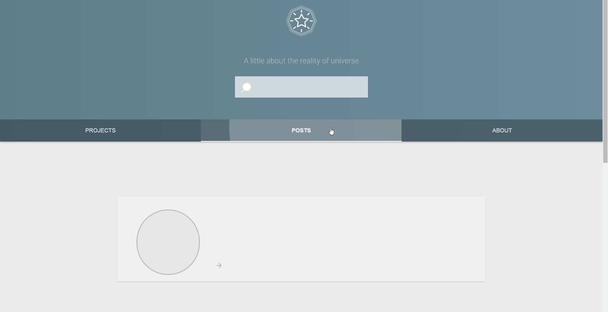

#Knocking Star

Knocking Star is a portfolio and blogging site that's created with various technologies:
  - Spring Boot
  - Polymer
  - Gradle
  - Bower
  
###Compatibility
Since the web components is not supported by all browsers this content is fully compatible with only Opera and Chrome. Although, with a little hack you can make it compatible with Firefox. Check the status from [here](http://jonrimmer.github.io/are-we-componentized-yet/).

###Issues 
This site isn't working dynamically for now. Because Neon-animated-pages doesn't satisfy needs. After adding more than two posts, to the page 'Posts', Neon-animated-pages doesn't resize thus the footer overlaps the content. Therefore I don't recommend you to use this site as a template site without fixing issues -but it would be okay to use if you are replace Neon-animated-pages with Iron-pages. Although, that might require to change most part of the CSS code.

###Contributing
Feel free to open a pull request that fixes issues or improve my code somehow.

###Usage
- Run ```gradle build``` command to build project and install bower dependencies. 
- Replace [database configuration](https://github.com/ufukomer/knocking-star/blob/master/src/main/resources/application.properties) with yours.
- Run ```gradle bootRun``` command to start web services and database connection.



###Licence
Apache License Version 2.0
